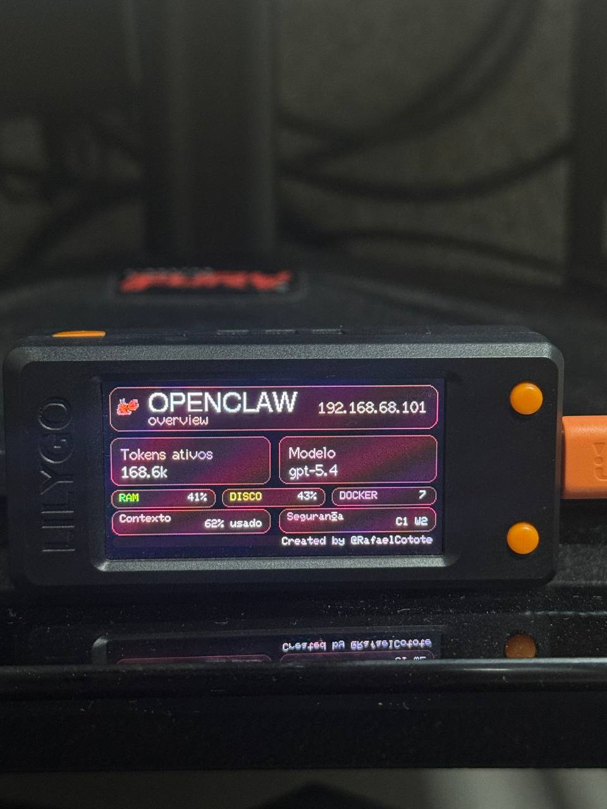
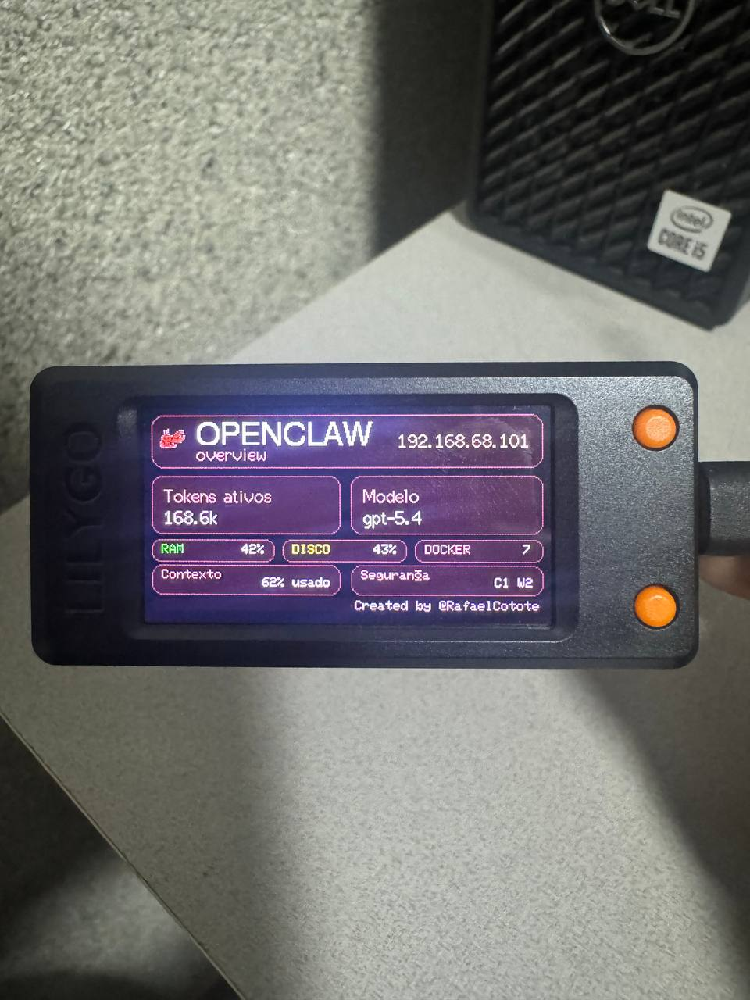

# OpenClaw T-Display Monitor

Um monitor físico para OpenClaw usando **LILYGO T-Display-S3 (ESP32-S3)**.

Esse projeto cria um pequeno dashboard em display TFT para mostrar status do OpenClaw via Wi‑Fi, consultando uma API HTTP local rodando no computador host.

---

## O que ele exibe

O firmware foi pensado como um painel compacto com múltiplas telas, navegáveis por botão físico:

- **Overview**
  - tokens ativos
  - modelo atual
  - RAM / disco / Docker
  - contexto
  - segurança

- **Clock + status**
  - hora
  - data
  - status do OpenClaw
  - Docker
  - load

- **Infra**
  - RAM
  - disco
  - Docker
  - gateway

- **Session**
  - input
  - output
  - cache
  - remaining tokens

A identidade visual usa tons avermelhados inspirados no OpenClaw

---

## Arquitetura

O projeto tem 3 partes:

### 1. API local no host
Arquivo:

- `openclaw_display_server.py`

Essa API roda no computador onde o OpenClaw está instalado.
Ela coleta dados do sistema e do OpenClaw e publica em:

- `http://IP_DO_HOST:8765/status`

### 2. Preview web
Arquivo:

- `web-preview.html`

Serve para testar o layout no navegador antes de gravar o firmware na placa.

### 3. Firmware ESP32
Arquivo:

- `OpenClawDisplayS3/OpenClawDisplayS3.ino`

O sketch conecta ao Wi‑Fi, consulta a API e desenha as telas no display.

---

## Estrutura do repositório

```text
openclaw-t-display-monitor/
├── assets/
│   ├── openclaw-monitor-angle-1.jpg
│   └── openclaw-monitor-angle-2.jpg
├── openclaw_display_server.py
├── openclaw-display.service
├── openclaw-logo.svg
├── web-preview.html
├── README.md
└── OpenClawDisplayS3/
    └── OpenClawDisplayS3.ino
```

## Fotos do projeto





---

## Requisitos

### Host
- Linux / Ubuntu
- Python 3
- OpenClaw funcionando
- acesso local de rede entre host e ESP32
- Docker opcional (se quiser exibir containers)

### Hardware
- LILYGO T-Display-S3
- cabo USB de dados
- Arduino IDE

---

## Como funciona

1. o host roda a API Python
2. a API expõe `/status`
3. o ESP32 conecta no mesmo Wi‑Fi
4. o ESP32 faz requisições HTTP nessa URL
5. o botão físico troca de tela manualmente

---

## Passo 1 — rodar a API no host

Entre na pasta do projeto:

```bash
cd openclaw-t-display-monitor
```

Rode manualmente:

```bash
python3 openclaw_display_server.py
```

Teste localmente:

```bash
curl http://127.0.0.1:8765/status
```

Descubra o IP da máquina host:

```bash
hostname -I
```

Exemplo:

```text
192.168.68.101
```

Então a URL da API será algo como:

```text
http://192.168.68.101:8765/status
```

---

## Passo 2 — liberar a porta no firewall

Se o host usa UFW:

```bash
sudo ufw allow 8765/tcp
```

Confira:

```bash
sudo ufw status
```

---

## Passo 3 — opcional: rodar como serviço

O projeto inclui um service file:

- `openclaw-display.service`

Instalação:

```bash
sudo cp openclaw-display.service /etc/systemd/system/
sudo systemctl daemon-reload
sudo systemctl enable --now openclaw-display.service
sudo systemctl status openclaw-display.service
```

Reiniciar após mudanças:

```bash
sudo systemctl restart openclaw-display.service
```

---

## Passo 4 — testar o preview web

Com a API rodando, abra:

```text
http://127.0.0.1:8765/preview
```

ou:

```text
http://IP_DO_HOST:8765/preview
```

Isso ajuda a validar o layout antes do upload para o hardware.

---

## Passo 5 — preparar a Arduino IDE

### 5.1 Adicionar suporte ESP32
Na Arduino IDE, vá em:

**File > Preferences**

No campo **Additional boards manager URLs**, adicione:

```text
https://raw.githubusercontent.com/espressif/arduino-esp32/gh-pages/package_esp32_index.json
```

Depois abra:

**Tools > Board > Boards Manager**

Pesquise por:

```text
esp32
```

Instale:

- **esp32 by Espressif Systems**

---

### 5.2 Instalar bibliotecas
Instale na Arduino IDE:

- **TFT_eSPI**
- **ArduinoJson**

---

### 5.3 Configurar TFT_eSPI corretamente
Abra o arquivo da biblioteca:

```text
~/Arduino/libraries/TFT_eSPI/User_Setup_Select.h
```

Deixe **somente** este setup ativo:

```cpp
//#include <User_Setup.h>
#include <User_Setups/Setup206_LilyGo_T_Display_S3.h>
```

Isso é importante. Se `User_Setup.h` ficar ativo junto, o display pode ficar torto/desconfigurado.

---

## Passo 6 — configurar a placa na IDE

Na Arduino IDE use algo próximo disso:

- **Board:** `ESP32S3 Dev Module`
- **Port:** `/dev/ttyACM0` (ou a porta correspondente)
- **USB CDC On Boot:** `Enabled`
- **CPU Frequency:** `240MHz (WiFi)`
- **Flash Mode:** `QIO 80MHz`
- **Flash Size:** `16MB`
- **Partition Scheme:** `16M Flash (3MB APP/9.9MB FATFS)`
- **PSRAM:** `OPI PSRAM`
- **Upload Mode:** `UART0 / Hardware CDC`
- **USB Mode:** `CDC and JTAG`

---

## Passo 7 — configurar o firmware

Abra:

```text
OpenClawDisplayS3/OpenClawDisplayS3.ino
```

Edite estas linhas:

```cpp
const char* WIFI_SSID = "SEU_WIFI";
const char* WIFI_PASSWORD = "SUA_SENHA";
const char* API_URL = "http://IP_DO_HOST:8765/status";
```

Exemplo:

```cpp
const char* WIFI_SSID = "MinhaRede";
const char* WIFI_PASSWORD = "MinhaSenha";
const char* API_URL = "http://192.168.68.101:8765/status";
```

---

## Passo 8 — subir para a placa

1. conecte a placa por USB
2. selecione a porta correta
3. clique em **Upload**

Se o upload falhar, tente modo boot manual:

1. segure **BOOT**
2. aperte **RST**
3. solte **RST**
4. solte **BOOT**
5. envie novamente

---

## Permissão serial no Linux

Se aparecer erro como porta não legível (`/dev/ttyACM0 is not readable`):

```bash
sudo usermod -aG dialout $USER
```

Depois faça logout/login e tente de novo.

---

## Navegação entre telas

O firmware foi configurado para:

- **não usar carrossel automático**
- trocar de tela via **botão físico**

No sketch atual:

```cpp
const int BUTTON_PIN = 0;
```

Se em outra revisão da placa o botão não responder, talvez seja necessário ajustar esse pino.

---

## Problemas comuns

### O display ficou torto / cortado
Revise o `TFT_eSPI`:

```cpp
#include <User_Setups/Setup206_LilyGo_T_Display_S3.h>
```

E confirme que `User_Setup.h` está comentado.

### A placa mostra tela offline
Verifique:
- se o host está com a API rodando
- se o IP no `API_URL` está correto
- se a porta `8765` está liberada no firewall
- se o ESP32 e o host estão na mesma rede

### O upload compilou mas não sobe
Revise:
- Board correta (`ESP32S3 Dev Module`)
- porta correta (`/dev/ttyACM0` ou equivalente)
- modo boot manual com BOOT + RST

---

## Como compartilhar com outra pessoa

O fluxo para outra pessoa replicar é:

1. clonar este repositório
2. rodar a API Python no host dela
3. ajustar `WIFI_SSID`, `WIFI_PASSWORD` e `API_URL`
4. configurar a Arduino IDE
5. gravar no LILYGO T-Display-S3

Esse projeto foi preparado para isso, então não depende de caminhos específicos da sua máquina.

---

## Sugestão para publicação no GitHub

Nome de repositório sugerido:

```text
openclaw-t-display-monitor
```

Arquivos que devem ser publicados:

- `openclaw_display_server.py`
- `openclaw-display.service`
- `openclaw-logo.svg`
- `web-preview.html`
- `OpenClawDisplayS3/OpenClawDisplayS3.ino`
- `README.md`

Opcionalmente você pode incluir prints e fotos do display funcionando.

---

## Próximas melhorias possíveis

- configuração via `.json`
- logo oficial ainda mais refinada no TFT
- temas alternativos
- botão para navegar para trás
- autodiscovery do host na rede
- tela extra com alertas ou métricas customizadas

---

## Créditos

Created by @RafaelCotote

Com assistência do OpenClaw para API local, preview web e firmware ESP32.
